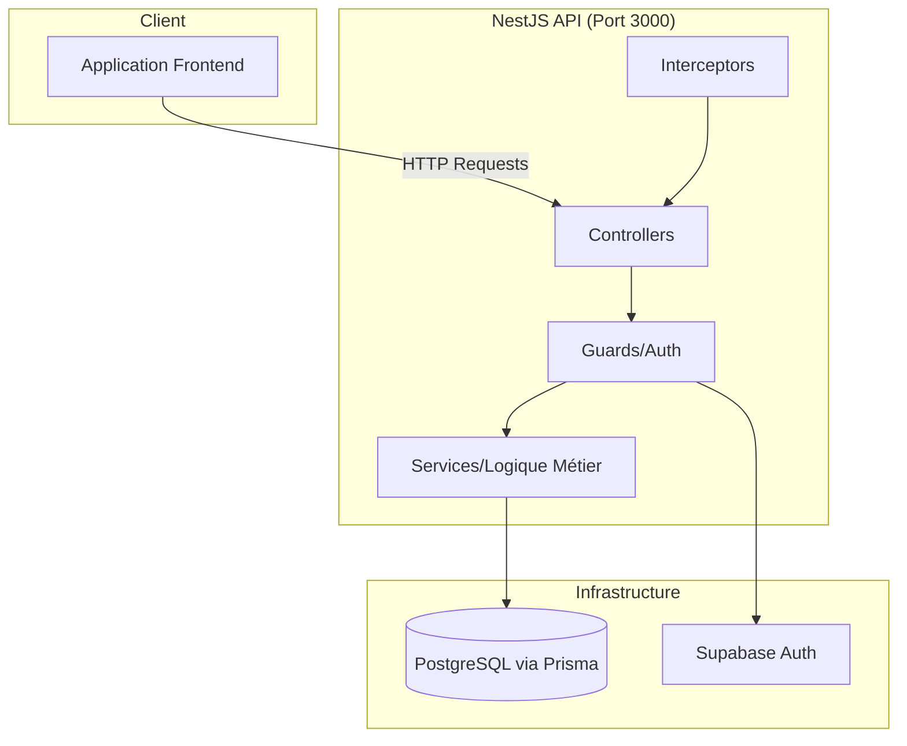
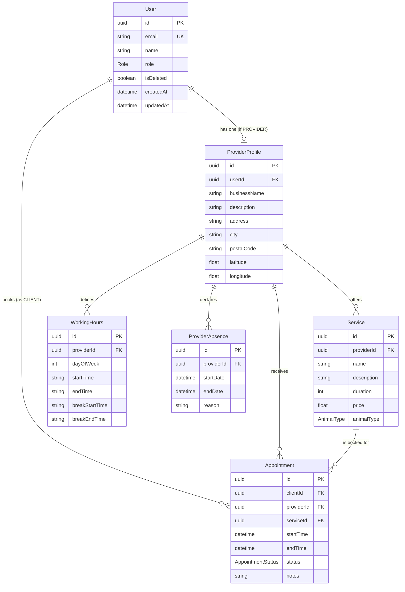
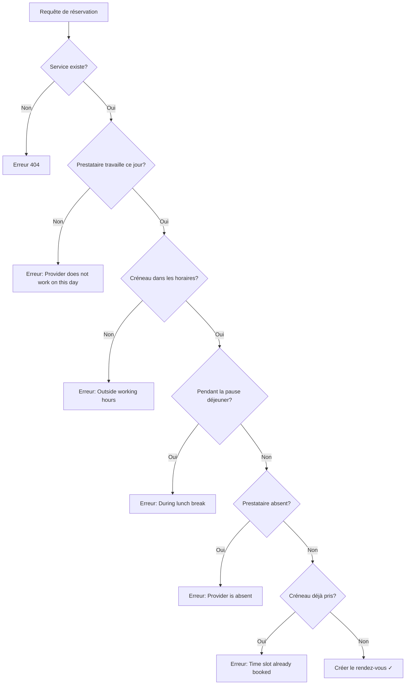
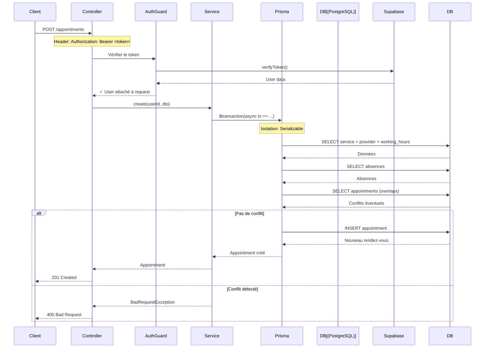

# 📖 Documentation Complète de l'API Kompagni

> **Kompagni** est une API RESTful de marketplace pour les services animaliers (toilettage, vétérinaires, etc.) permettant aux clients de réserver des rendez-vous avec des prestataires.

---

## 🎯 Vue d'Ensemble (High-Level Overview)

### Objectif Principal

L'API Kompagni permet de :
1. **Gérer les utilisateurs** (clients, prestataires, administrateurs)
2. **Rechercher des prestataires** (par ville, code postal, type d'animal)
3. **Consulter les services proposés** (toilettage, soins, etc.)
4. **Réserver des rendez-vous** avec gestion des créneaux disponibles
5. **Gérer le statut des rendez-vous** (confirmation, annulation)

### Architecture Technique



### Technologies Utilisées

| Composant | Technologie | Version |
|-----------|-------------|---------|
| Framework Backend | NestJS | v11 |
| ORM | Prisma | v6.19 |
| Base de Données | PostgreSQL | - |
| Authentification | Supabase Auth | - |
| Validation | class-validator + Zod | - |
| Documentation API | Swagger | v11.2 |
| Rate Limiting | @nestjs/throttler | v6.5 |

---

## 📂 Structure du Projet

```
kompagni-api/
├── prisma/
│   └── schema.prisma          # Schéma de base de données
├── src/
│   ├── main.ts                # Point d'entrée de l'application
│   ├── app.module.ts          # Module racine
│   ├── app.controller.ts      # Controller racine (Hello World)
│   ├── app.service.ts         # Service racine
│   │
│   ├── config/                # Validation des variables d'environnement
│   │   └── config.validation.ts
│   │
│   ├── common/                # Éléments partagés
│   │   ├── decorators/        # Décorateurs personnalisés
│   │   ├── guards/            # Guards d'authentification et rôles
│   │   ├── interceptors/      # Interceptors (logging)
│   │   └── interfaces/        # Interfaces TypeScript
│   │
│   ├── prisma/                # Module de connexion BDD
│   ├── supabase/              # Module d'authentification
│   ├── users/                 # Gestion des utilisateurs
│   ├── providers/             # Gestion des prestataires
│   ├── services/              # Gestion des services proposés
│   ├── appointments/          # Gestion des rendez-vous
│   ├── notifications/         # Système de notifications (email)
│   └── health/                # Endpoints de santé
│
└── test/                      # Tests end-to-end
```

---

## 🗄️ Modèle de Données (Prisma Schema)

### Diagramme des Relations



### Enums (Types énumérés)

| Enum | Valeurs | Description |
|------|---------|-------------|
| `Role` | CLIENT, PROVIDER, ADMIN | Rôle de l'utilisateur |
| `AppointmentStatus` | PENDING, CONFIRMED, COMPLETED, CANCELLED | Statut d'un rendez-vous |
| `AnimalType` | DOG, CAT, OTHER | Type d'animal pour un service |

---

## 📁 Détail Fichier par Fichier

### 🔵 Fichiers Racine

#### [main.ts](file:///c:/Users/neven/Dev/Kompagni/kompagni-api/src/main.ts)
**Rôle** : C'est le **point d'entrée** de toute l'application. Il démarre le serveur NestJS.

**Ce qu'il fait** :
- Crée l'application NestJS avec `NestFactory.create()`
- Active **Helmet** pour la sécurité HTTP (headers de protection)
- Configure **CORS** pour autoriser le frontend à communiquer
- Active la **validation globale** des données entrantes (ValidationPipe)
- Configure les **interceptors** globaux (logging, serialization)
- Démarre **Swagger** pour la documentation API sur `/api`
- Lance le serveur sur le port 3000 (ou via variable d'env)

**En langage simple** : "C'est le fichier qui allume l'application et configure toutes les options de démarrage."

---

#### [app.module.ts](file:///c:/Users/neven/Dev/Kompagni/kompagni-api/src/app.module.ts)
**Rôle** : C'est le **module racine** qui assemble tous les autres modules.

**Ce qu'il fait** :
- Importe `ConfigModule` pour gérer les variables d'environnement
- Configure le **rate limiting** (100 requêtes/minute globalement)
- Importe tous les modules fonctionnels : Users, Providers, Services, Appointments, Health, Notifications
- Enregistre le `ThrottlerGuard` comme guard global

**En langage simple** : "C'est le chef d'orchestre qui connecte toutes les parties de l'API ensemble."

---

### 🟢 Module Prisma (Connexion Base de Données)

#### [prisma.service.ts](file:///c:/Users/neven/Dev/Kompagni/kompagni-api/src/prisma/prisma.service.ts)
**Rôle** : Fournit la **connexion à PostgreSQL** via Prisma ORM.

**Ce qu'il fait** :
- Étend `PrismaClient` pour hériter de toutes les méthodes Prisma
- Se connecte automatiquement au démarrage (`onModuleInit`)
- Se déconnecte proprement à l'arrêt (`onModuleDestroy`)

**En langage simple** : "C'est le pont entre l'API et la base de données. Tous les autres services l'utilisent pour lire/écrire des données."

#### [prisma.module.ts](file:///c:/Users/neven/Dev/Kompagni/kompagni-api/src/prisma/prisma.module.ts)
**Rôle** : Exporte `PrismaService` globalement (décorateur `@Global()`).

**En langage simple** : "Grâce à ce module, n'importe quel autre module peut utiliser PrismaService sans l'importer explicitement."

---

### 🟠 Module Supabase (Authentification)

#### [supabase.service.ts](file:///c:/Users/neven/Dev/Kompagni/kompagni-api/src/supabase/supabase.service.ts)
**Rôle** : Gère l'**authentification des utilisateurs** via Supabase.

**Ce qu'il fait** :
- Crée un client Supabase avec l'URL et la clé secrète (depuis `.env`)
- `verifyToken(token)` : Vérifie si un token JWT est valide et retourne l'utilisateur
- `adminDeleteUser(userId)` : Supprime un utilisateur (fonction admin)

**En langage simple** : "Quand un utilisateur envoie son token, ce service vérifie s'il est authentique."

#### [supabase.module.ts](file:///c:/Users/neven/Dev/Kompagni/kompagni-api/src/supabase/supabase.module.ts)
**Rôle** : Exporte `SupabaseService` globalement.

---

### 🔒 Module Common (Éléments Partagés)

#### [auth.guard.ts](file:///c:/Users/neven/Dev/Kompagni/kompagni-api/src/common/guards/auth.guard.ts)
**Rôle** : **Protège les routes** qui nécessitent une authentification.

**Ce qu'il fait** :
1. Récupère le header `Authorization: Bearer <token>`
2. Extrait le token
3. Appelle `SupabaseService.verifyToken()` pour valider
4. Si valide → attache l'utilisateur à la requête (`request.user`)
5. Si invalide → renvoie erreur 401 Unauthorized

**En langage simple** : "C'est le videur à l'entrée : sans badge valide, tu ne passes pas."

---

#### [roles.guard.ts](file:///c:/Users/neven/Dev/Kompagni/kompagni-api/src/common/guards/roles.guard.ts)
**Rôle** : Vérifie que l'utilisateur a le **bon rôle** pour accéder à une ressource.

**Ce qu'il fait** :
1. Lit les rôles requis définis sur la route (via `@Roles()`)
2. Compare avec le rôle de l'utilisateur connecté
3. Autorise ou refuse l'accès

**En langage simple** : "Même si tu as un badge, tu dois aussi avoir la bonne couleur de badge pour entrer dans certaines salles."

---

#### [roles.decorator.ts](file:///c:/Users/neven/Dev/Kompagni/kompagni-api/src/common/decorators/roles.decorator.ts)
**Rôle** : Décorateur personnalisé pour définir les rôles requis sur une route.

**Exemple d'utilisation** :
```typescript
@Roles(Role.ADMIN)  // Seuls les admins peuvent accéder
@Get()
getAll() { ... }
```

---

#### [logging.interceptor.ts](file:///c:/Users/neven/Dev/Kompagni/kompagni-api/src/common/interceptors/logging.interceptor.ts)
**Rôle** : **Log toutes les requêtes** HTTP avec leur durée.

**Ce qu'il fait** :
- Enregistre la méthode, l'URL et le temps de réponse
- Format : `GET /appointments - 45ms`

**En langage simple** : "C'est la caméra de surveillance qui note toutes les entrées/sorties."

---

#### [authenticated-request.interface.ts](file:///c:/Users/neven/Dev/Kompagni/kompagni-api/src/common/interfaces/authenticated-request.interface.ts)
**Rôle** : Définit le **type TypeScript** d'une requête authentifiée.

**Ce qu'il contient** :
```typescript
interface AuthenticatedRequest extends Request {
  user: User;  // L'utilisateur Supabase attaché
}
```

---

### ⚙️ Module Config

#### [config.validation.ts](file:///c:/Users/neven/Dev/Kompagni/kompagni-api/src/config/config.validation.ts)
**Rôle** : **Valide les variables d'environnement** au démarrage avec Zod.

**Variables vérifiées** :
- `DATABASE_URL` : URL de connexion PostgreSQL
- `SUPABASE_URL` / `SUPABASE_SERVICE_KEY` : Credentials Supabase
- `JWT_SECRET` : Secret pour les tokens (min 16 caractères)
- `NODE_ENV` : development | production | test
- `PORT` : Port du serveur (défaut: 3000)
- `FRONTEND_URL` : URL du frontend pour CORS

**En langage simple** : "Au démarrage, l'API vérifie que toutes les clés secrètes sont bien configurées. Sinon, elle refuse de démarrer."

---

### 👤 Module Users

#### [users.controller.ts](file:///c:/Users/neven/Dev/Kompagni/kompagni-api/src/users/users.controller.ts)
**Rôle** : Expose les endpoints pour la gestion des utilisateurs.

| Méthode | Route | Accès | Description |
|---------|-------|-------|-------------|
| GET | `/users` | ADMIN only | Liste tous les utilisateurs |

**Particularité** : Protégé par `AuthGuard` + `RolesGuard` avec `@Roles(Role.ADMIN)`.

---

#### [users.service.ts](file:///c:/Users/neven/Dev/Kompagni/kompagni-api/src/users/users.service.ts)
**Rôle** : Logique métier pour les utilisateurs.

**Méthodes** :
- `findAll()` : Retourne tous les utilisateurs
- `findById(id)` : Trouve un utilisateur par son UUID

---

### 🏪 Module Providers (Prestataires)

#### [providers.controller.ts](file:///c:/Users/neven/Dev/Kompagni/kompagni-api/src/providers/providers.controller.ts)
**Rôle** : Endpoints pour les profils prestataires.

| Méthode | Route | Accès | Description |
|---------|-------|-------|-------------|
| GET | `/providers/search` | Public | Recherche de prestataires |
| POST | `/providers` | PROVIDER | Créer son profil prestataire |
| GET | `/providers/me` | Authentifié | Voir son propre profil |
| PATCH | `/providers/me` | PROVIDER | Modifier son profil |
| PUT | `/providers/me/working-hours` | PROVIDER | Définir ses horaires |

---

#### [providers.service.ts](file:///c:/Users/neven/Dev/Kompagni/kompagni-api/src/providers/providers.service.ts)
**Rôle** : Logique métier pour les prestataires.

**Méthodes** :
- `create(userId, dto)` : Crée un profil prestataire lié à l'utilisateur
- `findOne(userId)` : Retourne le profil avec services et horaires
- `update(userId, dto)` : Met à jour le profil
- `updateWorkingHours(userId, hours)` : Remplace tous les horaires (transaction)
- `search(dto)` : Recherche par nom, ville, code postal ou type d'animal

**Particularité** : La mise à jour des horaires utilise une **transaction** pour supprimer les anciens et créer les nouveaux atomiquement.

---

#### DTOs (Data Transfer Objects)

**[provider.dto.ts](file:///c:/Users/neven/Dev/Kompagni/kompagni-api/src/providers/dto/provider.dto.ts)** :
- `CreateProviderDto` : businessName, address, city, postalCode, latitude/longitude
- `UpdateProviderDto` : Même champs mais optionnels
- `WorkingHoursDto` : dayOfWeek (0-6), startTime, endTime, breakStartTime, breakEndTime

**[search.dto.ts](file:///c:/Users/neven/Dev/Kompagni/kompagni-api/src/providers/dto/search.dto.ts)** :
- `q` : Recherche textuelle
- `animalType` : Filtrer par DOG, CAT, OTHER

---

### 🛠️ Module Services

#### [services.controller.ts](file:///c:/Users/neven/Dev/Kompagni/kompagni-api/src/services/services.controller.ts)
**Rôle** : CRUD complet pour les services proposés par les prestataires.

| Méthode | Route | Accès | Description |
|---------|-------|-------|-------------|
| GET | `/services` | Public | Liste les services (filtrable par providerId) |
| GET | `/services/:id` | Public | Détail d'un service |
| POST | `/services` | Authentifié | Créer un service (lié auto au provider) |
| PATCH | `/services/:id` | Authentifié | Modifier un service (propriétaire only) |
| DELETE | `/services/:id` | Authentifié | Supprimer un service (propriétaire only) |

---

#### [services.service.ts](file:///c:/Users/neven/Dev/Kompagni/kompagni-api/src/services/services.service.ts)
**Rôle** : Logique métier pour les services.

**Sécurité** :
- `create()` : Vérifie que l'utilisateur a un profil prestataire avant de créer
- `update()` / `remove()` : Vérifie que l'utilisateur est le propriétaire du service

---

### 📅 Module Appointments (Rendez-vous)

#### [appointments.controller.ts](file:///c:/Users/neven/Dev/Kompagni/kompagni-api/src/appointments/appointments.controller.ts)
**Rôle** : Cœur de l'application - gestion des rendez-vous.

| Méthode | Route | Description |
|---------|-------|-------------|
| POST | `/appointments` | Réserver un rendez-vous |
| GET | `/appointments/available-slots` | Obtenir les créneaux disponibles |
| GET | `/appointments` | Voir mes rendez-vous (client ou prestataire) |
| GET | `/appointments/:id` | Détail d'un rendez-vous |
| PATCH | `/appointments/:id/status` | Changer le statut (confirmer, annuler) |

**Rate Limiting** : 20 requêtes/minute (plus strict que le global).

---

#### [appointments.service.ts](file:///c:/Users/neven/Dev/Kompagni/kompagni-api/src/appointments/appointments.service.ts)
**Rôle** : **Logique métier complexe** pour les réservations.

##### Méthode `create()` - Réserver un rendez-vous

C'est la méthode la plus critique. Elle utilise une **transaction Serializable** pour éviter les doubles réservations (race conditions).

**Étapes** :
1. **Récupérer le service** et ses informations (durée, prestataire)
2. **Vérifier les horaires de travail** du jour concerné
3. **Vérifier que le créneau est dans les heures de travail**
4. **Vérifier la pause déjeuner** (pas de chevauchement)
5. **Vérifier les absences** du prestataire
6. **Vérifier les rendez-vous existants** (pas de conflit)
7. **Créer le rendez-vous** avec statut PENDING



##### Méthode `getAvailableSlots()` - Créneaux disponibles

Retourne tous les créneaux libres pour une date donnée.

**Logique** :
1. Parse la date demandée
2. Récupère les horaires de travail du jour
3. Récupère les absences du prestataire
4. Récupère les rendez-vous existants
5. Génère tous les créneaux possibles (selon la durée du service)
6. Filtre les créneaux qui chevauchent : pause déjeuner, absences, ou autres rdv

---

#### DTOs Appointments

**[appointment.dto.ts](file:///c:/Users/neven/Dev/Kompagni/kompagni-api/src/appointments/dto/appointment.dto.ts)** :
- `CreateAppointmentDto` : serviceId, startTime (ISO 8601), notes (optionnel)
- `UpdateAppointmentStatusDto` : status (enum AppointmentStatus)

---

### 📧 Module Notifications

#### [notifications.module.ts](file:///c:/Users/neven/Dev/Kompagni/kompagni-api/src/notifications/notifications.module.ts)
**Rôle** : Module préparé pour l'envoi de notifications.

#### [email.service.ts](file:///c:/Users/neven/Dev/Kompagni/kompagni-api/src/notifications/email.service.ts)
**Rôle** : Service d'envoi d'emails (actuellement en mode **stub/log**).

**État actuel** : Log simplement les emails à envoyer.
**TODO** : Intégrer un vrai provider (Nodemailer, SendGrid, etc.)

---

### 🏥 Module Health

#### [health.controller.ts](file:///c:/Users/neven/Dev/Kompagni/kompagni-api/src/health/health.controller.ts)
**Rôle** : Endpoint `/health` pour vérifier l'état de l'API.

**Checks effectués** :
1. **Database** : Teste la connexion PostgreSQL
2. **Supabase** : Teste la connexion Supabase Auth

---

#### [prisma.health.ts](file:///c:/Users/neven/Dev/Kompagni/kompagni-api/src/health/indicators/prisma.health.ts)
**Rôle** : Health check for PostgreSQL.

**Ce qu'il fait** : Exécute `SELECT 1` pour vérifier la connexion.

---

#### [supabase.health.ts](file:///c:/Users/neven/Dev/Kompagni/kompagni-api/src/health/indicators/supabase.health.ts)
**Rôle** : Health check for Supabase.

**Ce qu'il fait** : Appelle `auth.getSession()` pour tester la connectivité.

---

## 🔄 Cycle de Vie d'une Requête

Prenons l'exemple d'une **réservation de rendez-vous** :



---

## 🔐 Résumé de la Sécurité

| Couche | Protection |
|--------|------------|
| **Transport** | HTTPS (Helmet headers) |
| **Rate Limiting** | 100 req/min global, 20 req/min pour appointments |
| **Authentification** | JWT via Supabase Auth |
| **Autorisation** | RBAC (CLIENT, PROVIDER, ADMIN) |
| **Validation** | class-validator sur tous les DTOs |
| **Transactions** | Isolation Serializable pour éviter les race conditions |
| **Env Validation** | Zod au démarrage |

---

## 📊 Endpoints API Récapitulatif

| Module | Méthode | Endpoint | Auth | Rôle | Description |
|--------|---------|----------|------|------|-------------|
| App | GET | `/` | ❌ | - | Hello World |
| Health | GET | `/health` | ❌ | - | Statut de l'API |
| Users | GET | `/users` | ✅ | ADMIN | Liste utilisateurs |
| Providers | GET | `/providers/search` | ❌ | - | Recherche prestataires |
| Providers | POST | `/providers` | ✅ | PROVIDER | Créer profil |
| Providers | GET | `/providers/me` | ✅ | - | Mon profil |
| Providers | PATCH | `/providers/me` | ✅ | PROVIDER | Modifier profil |
| Providers | PUT | `/providers/me/working-hours` | ✅ | PROVIDER | Définir horaires |
| Services | GET | `/services` | ❌ | - | Liste services |
| Services | GET | `/services/:id` | ❌ | - | Détail service |
| Services | POST | `/services` | ✅ | - | Créer service |
| Services | PATCH | `/services/:id` | ✅ | - | Modifier service |
| Services | DELETE | `/services/:id` | ✅ | - | Supprimer service |
| Appointments | POST | `/appointments` | ✅ | - | Réserver |
| Appointments | GET | `/appointments/available-slots` | ✅ | - | Créneaux dispo |
| Appointments | GET | `/appointments` | ✅ | - | Mes rendez-vous |
| Appointments | GET | `/appointments/:id` | ✅ | - | Détail rendez-vous |
| Appointments | PATCH | `/appointments/:id/status` | ✅ | - | Changer statut |

---

## 🚀 Comment Démarrer

```bash
# 1. Installer les dépendances
npm install

# 2. Configurer l'environnement
cp .env.example .env
# Remplir les variables dans .env

# 3. Générer le client Prisma
npx prisma generate

# 4. Appliquer les migrations
npx prisma migrate dev

# 5. Lancer en développement
npm run start:dev

# 6. Accéder à Swagger
# http://localhost:3000/api
```

---

## 📝 Notes pour les Développeurs

1. **Tous les UUID** sont générés automatiquement par Prisma/PostgreSQL.
2. **Les dates** sont au format ISO 8601 (ex: `2025-12-25T10:00:00Z`).
3. **Les horaires de travail** sont au format 24h (`"09:00"`, `"18:00"`).
4. **Le dayOfWeek** suit la convention JavaScript : 0 = Dimanche, 6 = Samedi.
5. **Les transactions Serializable** peuvent échouer avec `P2034` si deux utilisateurs réservent le même créneau simultanément.

---

> 📌 **Documentation générée le** : 18 décembre 2025  
> 🔗 **Swagger disponible sur** : `http://localhost:3000/api`
