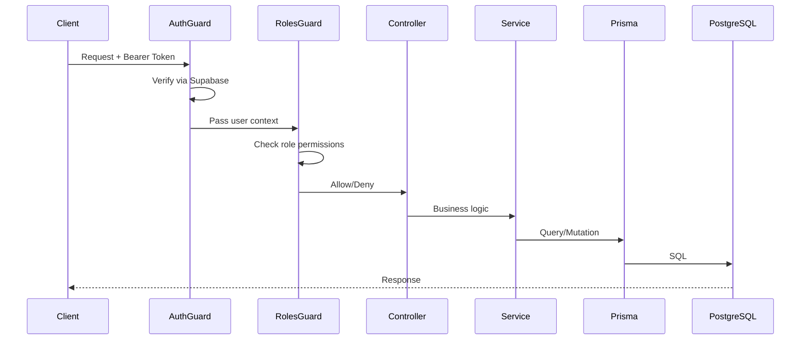
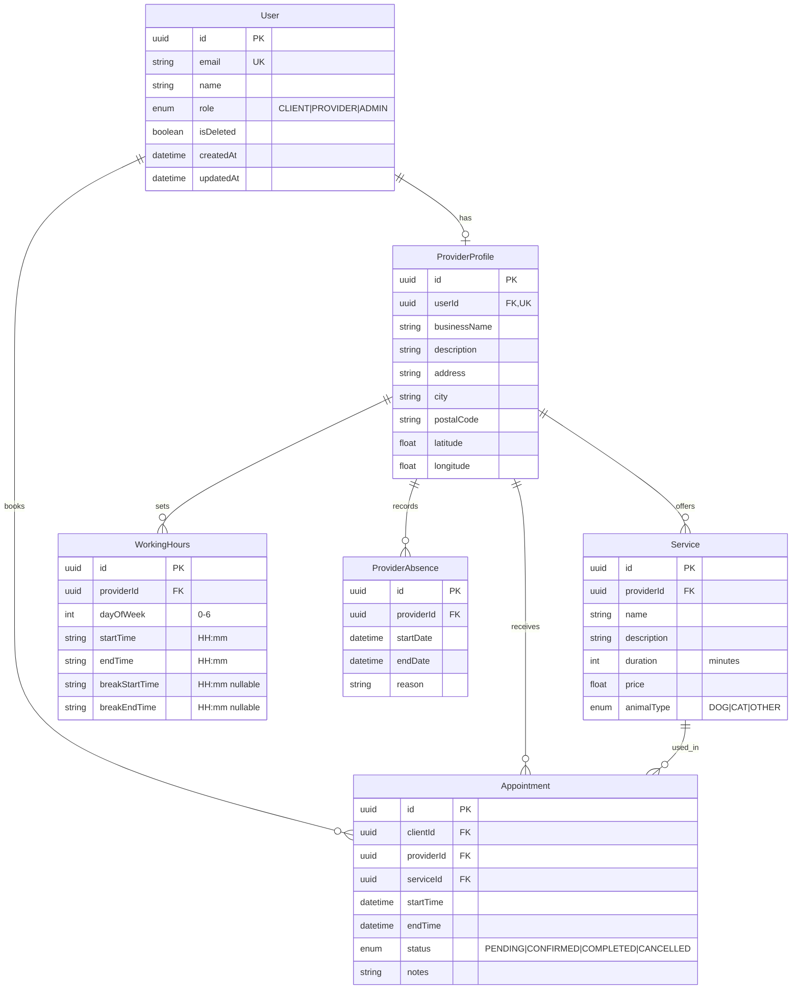

# Kompagni API - Complete Technical Report

> **Generated**: December 17, 2025
> **Version**: 0.0.1
> **Status**: Active Development
> **Platform**: NestJS + Prisma + Supabase + PostgreSQL

---

## Table of Contents
1. [Executive Summary](#1-executive-summary)
2. [Architecture Overview](#2-architecture-overview)
3. [Module Breakdown](#3-module-breakdown)
4. [API Endpoints Reference](#4-api-endpoints-reference)
5. [Database Schema](#5-database-schema)
6. [Security Implementation](#6-security-implementation)
7. [Business Logic Deep Dive](#7-business-logic-deep-dive)
8. [Testing Coverage](#8-testing-coverage)
9. [Configuration & Environment](#9-configuration--environment)
10. [Areas for Improvement](#10-areas-for-improvement)
11. [Production Readiness Checklist](#11-production-readiness-checklist)

---

## 1. Executive Summary

### What is Kompagni API?
Kompagni is a **pet service marketplace API** that connects pet owners (Clients) with service providers (Providers) such as groomers, veterinarians, and pet sitters. The API handles:
- User authentication and authorization
- Provider profile and service management
- Appointment scheduling with conflict detection
- Provider search and discovery

### Technology Stack
| Layer | Technology | Version |
|-------|------------|---------|
| Framework | NestJS | 11.x |
| ORM | Prisma | 6.19.x |
| Database | PostgreSQL | (via Supabase) |
| Auth Provider | Supabase Auth | - |
| Documentation | Swagger/OpenAPI | 11.x |
| Testing | Jest | 30.x |
| Language | TypeScript | 5.7.x |

### Current Health Status
| Check | Status |
|-------|--------|
| Linting | ✅ Pass |
| Build | ✅ Pass |
| Unit Tests | ✅ 7/7 Pass |
| E2E Tests | ✅ 21/21 Pass |

---

## 2. Architecture Overview

### Project Structure
```
kompagni-api/
├── src/
│   ├── app.module.ts           # Root module
│   ├── main.ts                 # Application entry point
│   │
│   ├── common/                 # Shared utilities
│   │   ├── decorators/         # Custom decorators (@Roles)
│   │   ├── guards/             # Auth guards (AuthGuard, RolesGuard)
│   │   └── interfaces/         # Shared interfaces
│   │
│   ├── prisma/                 # Database layer
│   │   └── prisma.service.ts   # Prisma client wrapper
│   │
│   ├── supabase/               # Auth provider
│   │   └── supabase.service.ts # Token verification
│   │
│   ├── users/                  # User management (Admin)
│   ├── providers/              # Provider profiles
│   ├── services/               # Pet services
│   ├── appointments/           # Booking system (Core)
│   └── notifications/          # Email (placeholder)
│
├── prisma/
│   └── schema.prisma           # Database schema
│
└── test/
    ├── app.e2e-spec.ts         # Basic E2E
    └── full-flow.e2e-spec.ts   # Comprehensive E2E
```

### Request Flow Diagram


---

## 3. Module Breakdown

### 3.1 AppModule (Root)
**File**: [app.module.ts](file:///c:/Users/neven/Dev/Kompagni/kompagni-api/src/app.module.ts)

Imports and orchestrates all feature modules:
- `PrismaModule` - Database access
- `UsersModule` - User management
- `SupabaseModule` - Authentication
- `ProvidersModule` - Provider profiles
- `ServicesModule` - Pet services
- `AppointmentsModule` - Booking system
- `NotificationsModule` - Email notifications

---

### 3.2 AuthenticationModule (Supabase)
**Files**:
- [supabase.service.ts](file:///c:/Users/neven/Dev/Kompagni/kompagni-api/src/supabase/supabase.service.ts)
- [auth.guard.ts](file:///c:/Users/neven/Dev/Kompagni/kompagni-api/src/common/guards/auth.guard.ts)

**Functionality**:
- Token verification via Supabase Auth API
- User context injection into request
- Guard-based route protection

**Key Methods**:
```typescript
verifyToken(token: string): Promise<User | null>
adminDeleteUser(userId: string): Promise<void>
```

---

### 3.3 UsersModule
**Files**:
- [users.controller.ts](file:///c:/Users/neven/Dev/Kompagni/kompagni-api/src/users/users.controller.ts)
- [users.service.ts](file:///c:/Users/neven/Dev/Kompagni/kompagni-api/src/users/users.service.ts)

**Purpose**: Admin-only user listing

| Endpoint | Auth | Roles | Description |
|----------|------|-------|-------------|
| `GET /users` | ✅ | ADMIN | List all users |

---

### 3.4 ProvidersModule
**Files**:
- [providers.controller.ts](file:///c:/Users/neven/Dev/Kompagni/kompagni-api/src/providers/providers.controller.ts)
- [providers.service.ts](file:///c:/Users/neven/Dev/Kompagni/kompagni-api/src/providers/providers.service.ts)

**Purpose**: Provider profile management

| Endpoint | Auth | Roles | Description |
|----------|------|-------|-------------|
| `GET /providers/search` | ❌ | - | Search providers (public) |
| `POST /providers` | ✅ | PROVIDER | Create profile |
| `GET /providers/me` | ✅ | - | Get own profile |
| `PATCH /providers/me` | ✅ | PROVIDER | Update profile |
| `PUT /providers/me/working-hours` | ✅ | PROVIDER | Set working hours |

---

### 3.5 ServicesModule
**Files**:
- [services.controller.ts](file:///c:/Users/neven/Dev/Kompagni/kompagni-api/src/services/services.controller.ts)
- [services.service.ts](file:///c:/Users/neven/Dev/Kompagni/kompagni-api/src/services/services.service.ts)

**Purpose**: Pet service CRUD

| Endpoint | Auth | Description |
|----------|------|-------------|
| `GET /services` | ❌ | List services (optional providerId filter) |
| `GET /services/:id` | ❌ | Get service details |
| `POST /services` | ✅ | Create service |
| `PATCH /services/:id` | ✅ | Update service (owner only) |
| `DELETE /services/:id` | ✅ | Delete service (owner only) |

---

### 3.6 AppointmentsModule ⭐ (Core)
**Files**:
- [appointments.controller.ts](file:///c:/Users/neven/Dev/Kompagni/kompagni-api/src/appointments/appointments.controller.ts)
- [appointments.service.ts](file:///c:/Users/neven/Dev/Kompagni/kompagni-api/src/appointments/appointments.service.ts)

**Purpose**: Appointment booking with advanced conflict detection

| Endpoint | Auth | Description |
|----------|------|-------------|
| `GET /appointments/available-slots` | ✅ | Get available time slots |
| `POST /appointments` | ✅ | Book appointment |
| `GET /appointments` | ✅ | List my appointments |
| `GET /appointments/:id` | ✅ | Get appointment details |
| `PATCH /appointments/:id/status` | ✅ | Update status |

---

### 3.7 NotificationsModule
**Files**:
- [email.service.ts](file:///c:/Users/neven/Dev/Kompagni/kompagni-api/src/notifications/email.service.ts)

**Status**: 🚧 Placeholder implementation

The email service is stubbed and logs to console. Ready for integration with:
- Nodemailer
- SendGrid
- Resend
- AWS SES

---

## 4. API Endpoints Reference

### Complete Endpoint Map

```
┌─────────────────────────────────────────────────────────────────┐
│                          KOMPAGNI API                           │
├─────────────────────────────────────────────────────────────────┤
│  Base URL: http://localhost:3000                                │
│  Docs URL: http://localhost:3000/api (Swagger UI)               │
├─────────────────────────────────────────────────────────────────┤
│                                                                 │
│  PUBLIC ENDPOINTS (No Auth Required)                            │
│  ─────────────────────────────────────                          │
│  GET  /                           → Health check                │
│  GET  /providers/search           → Search providers            │
│  GET  /services                   → List services               │
│  GET  /services/:id               → Service details             │
│                                                                 │
│  AUTHENTICATED ENDPOINTS                                        │
│  ─────────────────────────────────────                          │
│  GET  /appointments               → My appointments             │
│  GET  /appointments/available-slots → Available slots           │
│  GET  /appointments/:id           → Appointment details         │
│  POST /appointments               → Book appointment            │
│  PATCH /appointments/:id/status   → Update status               │
│                                                                 │
│  PROVIDER-ONLY ENDPOINTS                                        │
│  ─────────────────────────────────────                          │
│  POST /providers                  → Create provider profile     │
│  PATCH /providers/me              → Update profile              │
│  PUT  /providers/me/working-hours → Set working hours           │
│  POST /services                   → Create service              │
│  PATCH /services/:id              → Update service              │
│  DELETE /services/:id             → Delete service              │
│                                                                 │
│  CLIENT ENDPOINTS                                               │
│  ─────────────────────────────────────                          │
│  GET  /providers/me               → View own profile            │
│                                                                 │
│  ADMIN-ONLY ENDPOINTS                                           │
│  ─────────────────────────────────────                          │
│  GET  /users                      → List all users              │
│                                                                 │
└─────────────────────────────────────────────────────────────────┘
```

### Request/Response Examples

#### Book an Appointment
```http
POST /appointments
Authorization: Bearer <token>
Content-Type: application/json

{
  "serviceId": "uuid-of-service",
  "startTime": "2025-12-20T10:00:00.000Z",
  "notes": "My dog is a small poodle"
}
```

**Response (201)**:
```json
{
  "id": "uuid-of-appointment",
  "clientId": "uuid-of-client",
  "providerId": "uuid-of-provider",
  "serviceId": "uuid-of-service",
  "startTime": "2025-12-20T10:00:00.000Z",
  "endTime": "2025-12-20T11:00:00.000Z",
  "status": "PENDING",
  "notes": "My dog is a small poodle",
  "createdAt": "2025-12-17T...",
  "service": { ... },
  "provider": { ... }
}
```

---

## 5. Database Schema

### Entity Relationship Diagram


### Key Indexes & Constraints
- `User.email` - Unique
- `ProviderProfile.userId` - Unique (1:1 with User)
- `Appointment` - Composite lookups on `providerId + startTime`
- All FKs have `onDelete: Cascade`

---

## 6. Security Implementation

### Authentication Flow
```
┌──────────────────────────────────────────────────────────────┐
│                    AUTHENTICATION FLOW                        │
├──────────────────────────────────────────────────────────────┤
│                                                              │
│  1. User logs in via Supabase Auth (Frontend)                │
│  2. Supabase returns JWT access token                        │
│  3. Frontend includes token in Authorization header          │
│  4. AuthGuard intercepts request                             │
│  5. AuthGuard calls SupabaseService.verifyToken()            │
│  6. Supabase validates token and returns user data           │
│  7. User object attached to request.user                     │
│  8. RolesGuard checks user.role against @Roles() decorator   │
│  9. Request proceeds or 403 Forbidden                        │
│                                                              │
└──────────────────────────────────────────────────────────────┘
```

### Authorization Matrix
| Resource | CLIENT | PROVIDER | ADMIN |
|----------|--------|----------|-------|
| View providers | ✅ | ✅ | ✅ |
| Create provider profile | ❌ | ✅ | ❌ |
| Manage own services | ❌ | ✅ | ❌ |
| Book appointments | ✅ | ✅ | ✅ |
| Manage appointment status | Cancel only | ✅ Full | ❌ |
| List all users | ❌ | ❌ | ✅ |

### Security Features Implemented
- ✅ JWT Token Validation (Supabase)
- ✅ Role-Based Access Control (RBAC)
- ✅ Input Validation (class-validator)
- ✅ Ownership Checks (Services, Appointments)
- ✅ Soft Delete for Users (isDeleted flag)

### Security Gaps to Address
- ⚠️ No rate limiting
- ⚠️ CORS not explicitly configured
- ⚠️ No request logging/audit trail
- ⚠️ Missing helmet middleware for HTTP headers

---

## 7. Business Logic Deep Dive

### Appointment Booking Algorithm
The appointment creation in [appointments.service.ts](file:///c:/Users/neven/Dev/Kompagni/kompagni-api/src/appointments/appointments.service.ts) is the most complex piece of logic:

```
┌─────────────────────────────────────────────────────────────────┐
│              APPOINTMENT CREATION ALGORITHM                     │
├─────────────────────────────────────────────────────────────────┤
│                                                                 │
│  INPUT: serviceId, startTime, notes                            │
│                                                                 │
│  1. BEGIN TRANSACTION (Serializable Isolation)                 │
│     │                                                           │
│  2. ├─ Fetch Service + Provider + WorkingHours                 │
│     │                                                           │
│  3. ├─ Calculate endTime = startTime + service.duration        │
│     │                                                           │
│  4. ├─ VALIDATION: Working Hours                               │
│     │   ├─ Is provider working on this dayOfWeek?              │
│     │   └─ Is time within startTime-endTime range?             │
│     │                                                           │
│  5. ├─ VALIDATION: Lunch Break                                 │
│     │   └─ Does appointment overlap break period?              │
│     │                                                           │
│  6. ├─ VALIDATION: Absences                                    │
│     │   └─ Is provider absent during this time?                │
│     │                                                           │
│  7. ├─ VALIDATION: Existing Appointments                       │
│     │   └─ Any overlapping non-cancelled appointments?         │
│     │                                                           │
│  8. ├─ CREATE Appointment record                               │
│     │                                                           │
│  9. └─ COMMIT TRANSACTION                                       │
│                                                                 │
│  ERROR HANDLING:                                                │
│  - P2034 (Serialization conflict) → Retry message              │
│  - Any validation failure → BadRequestException                │
│                                                                 │
└─────────────────────────────────────────────────────────────────┘
```

### Available Slots Algorithm
```typescript
// Pseudocode for getAvailableSlots()
1. Parse target date
2. Get working hours for that day
3. Fetch all absences and existing appointments
4. Initialize cursor at work start time
5. Loop until cursor + duration > work end:
   a. Check if slot overlaps with any appointment
   b. Check if slot overlaps with lunch break
   c. Check if slot overlaps with any absence
   d. If no overlaps, add to available slots
   e. Advance cursor by service duration
6. Return available slots array
```

---

## 8. Testing Coverage

### Test Files
| File | Type | Tests | Status |
|------|------|-------|--------|
| [app.controller.spec.ts](file:///c:/Users/neven/Dev/Kompagni/kompagni-api/src/app.controller.spec.ts) | Unit | 1 | ✅ |
| [appointments.service.spec.ts](file:///c:/Users/neven/Dev/Kompagni/kompagni-api/src/appointments/appointments.service.spec.ts) | Unit | 6 | ✅ |
| [app.e2e-spec.ts](file:///c:/Users/neven/Dev/Kompagni/kompagni-api/test/app.e2e-spec.ts) | E2E | 1 | ✅ |
| [full-flow.e2e-spec.ts](file:///c:/Users/neven/Dev/Kompagni/kompagni-api/test/full-flow.e2e-spec.ts) | E2E | 20 | ✅ |

### Coverage Analysis
| Module | Unit Tests | E2E Tests | Coverage |
|--------|------------|-----------|----------|
| App | ✅ | ✅ | Good |
| Users | ❌ | ❌ | Missing |
| Providers | ❌ | ✅ | Partial |
| Services | ❌ | ✅ | Partial |
| Appointments | ✅ | ✅ | Excellent |
| Supabase | ❌ | Mocked | Partial |

### E2E Test Flows Covered
1. ✅ Create Provider User
2. ✅ Create Client User
3. ✅ Create Provider Profile
4. ✅ Update Provider Profile
5. ✅ Create Service
6. ✅ List Services
7. ✅ Get Service Details
8. ✅ Set Working Hours
9. ✅ Search Providers
10. ✅ Get Available Slots
11. ✅ Book Appointment
12. ✅ List Appointments
13. ✅ Get Appointment Details
14. ✅ Confirm Appointment
15. ✅ Complete Appointment
16. ✅ 401 Without Auth
17. ✅ 400 Invalid Data
18. ✅ 404 Not Found

---

## 9. Configuration & Environment

### Required Environment Variables
| Variable | Required | Description |
|----------|----------|-------------|
| `DATABASE_URL` | ✅ | PostgreSQL connection string |
| `DIRECT_URL` | ✅ | Direct DB URL (for migrations) |
| `SUPABASE_URL` | ✅ | Supabase project URL |
| `SUPABASE_SERVICE_KEY` | ✅ | Supabase service role key |
| `NODE_ENV` | ❌ | development/production |
| `PORT` | ❌ | Server port (default: 3000) |
| `JWT_SECRET` | ❌ | Not used (Supabase handles auth) |

### NPM Scripts
```json
{
  "start": "nest start",
  "start:dev": "nest start --watch",
  "start:prod": "node dist/main",
  "build": "nest build",
  "lint": "eslint \"{src,apps,libs,test}/**/*.ts\" --fix",
  "test": "jest",
  "test:e2e": "jest --config ./test/jest-e2e.json",
  "test:cov": "jest --coverage"
}
```

---

## 10. Areas for Improvement

### 🔴 High Priority (Before Production)

| Issue | Impact | Recommendation |
|-------|--------|----------------|
| No rate limiting | DDoS vulnerability | Add `@nestjs/throttler` |
| Missing CORS config | Security risk | Configure in `main.ts` |
| No health endpoint | Monitoring gaps | Add `@nestjs/terminus` |
| Env validation missing | Runtime errors | Use `Joi` with ConfigModule |

### 🟡 Medium Priority

| Issue | Impact | Recommendation |
|-------|--------|----------------|
| No logging middleware | Debugging difficulty | Add request logging |
| Email service stub | No notifications | Integrate email provider |
| Missing helmet | XSS risk | Add `helmet` middleware |
| No pagination | Performance | Add pagination to list endpoints |

### 🟢 Nice to Have

| Feature | Benefit |
|---------|---------|
| Caching (Redis) | Better performance |
| File uploads | Provider photos |
| Webhooks | Real-time integrations |
| GraphQL | Flexible queries |

---

## 11. Production Readiness Checklist

```
PRE-PRODUCTION CHECKLIST
═══════════════════════════════════════════════════════════════

  SECURITY
  □ Add helmet middleware
  □ Configure strict CORS policy
  □ Implement rate limiting
  □ Add input sanitization
  □ Set up WAF (Cloudflare, etc.)

  RELIABILITY
  □ Add health check endpoint
  □ Implement graceful shutdown
  □ Add database connection pooling
  □ Set up error monitoring (Sentry)

  OBSERVABILITY
  □ Structured logging (Winston/Pino)
  □ Request correlation IDs
  □ Performance monitoring (APM)
  □ Database query logging

  TESTING
  □ Add unit tests for all services ← Currently gaps
  □ Add integration tests for Supabase
  □ Load testing with k6 or Artillery
  □ Security scanning (OWASP ZAP)

  DEPLOYMENT
  □ Docker containerization
  □ CI/CD pipeline
  □ Database migrations strategy
  □ Secrets management

  DOCUMENTATION
  □ Update README.md
  □ API versioning strategy
  □ Changelog maintenance
  □ Runbook for operations

═══════════════════════════════════════════════════════════════
  CURRENT STATUS: 70% Production Ready
═══════════════════════════════════════════════════════════════
```

---

## Summary

The Kompagni API is a **well-architected, modular NestJS application** with solid foundations for a pet service marketplace. The core booking logic is robust with transaction-based conflict prevention.

### Strengths
- Clean module separation
- Strong TypeScript usage
- Excellent appointment logic
- Good E2E test coverage
- Swagger documentation ready

### Immediate Actions Needed
1. Add rate limiting (`@nestjs/throttler`)
2. Configure CORS properly
3. Add health check endpoint
4. Validate environment variables on startup

The API is approximately **70% production-ready** and can be deployed to a staging environment for further validation.
