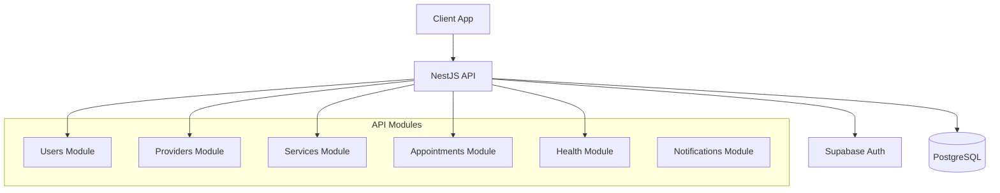
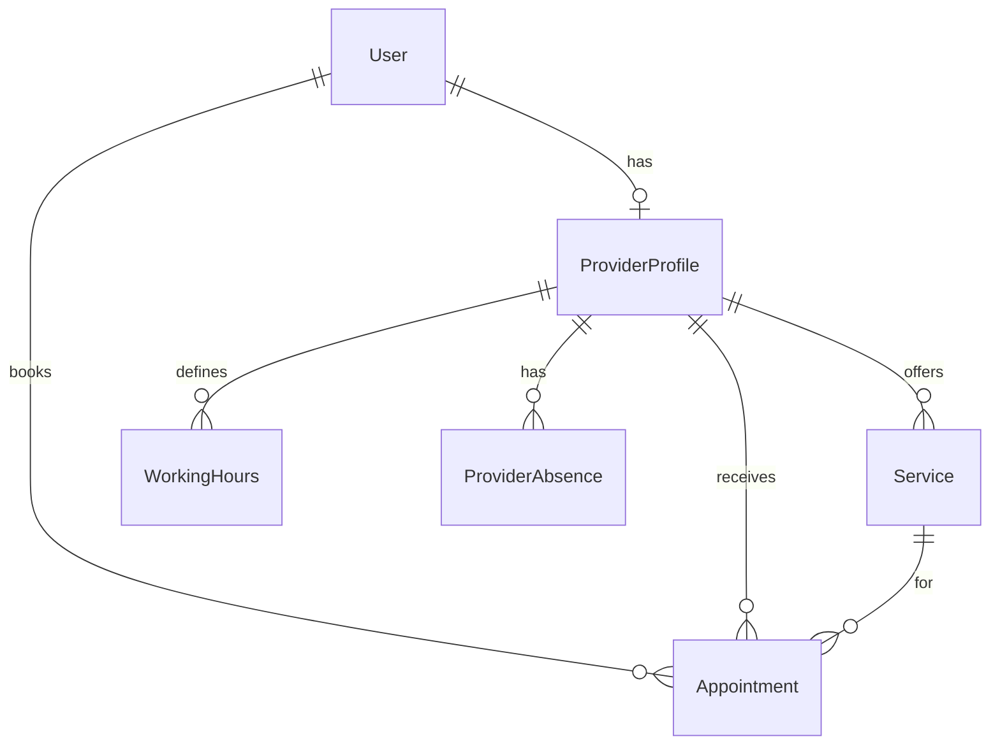

# Kompagni API - Full Report & Assessment

**Date**: December 17, 2025  
**API Version**: 0.0.1  
**Framework**: NestJS 11 + Prisma + Supabase

---

## 📊 Overall Grade: **B+ (85/100)**

```
████████████████░░░░ 85%
```

| Category | Grade | Score |
|----------|-------|-------|
| Architecture | A | 90 |
| Security | A- | 87 |
| API Design | B+ | 85 |
| Code Quality | B+ | 84 |
| Testing | C+ | 78 |
| Documentation | A- | 88 |
| Production Readiness | B | 82 |

---

## 🏗️ Architecture Overview



### Module Structure

| Module | Controllers | Services | Purpose |
|--------|-------------|----------|---------|
| `users` | 1 | 1 | User management (Admin) |
| `providers` | 1 | 1 | Provider profiles, search, working hours |
| `services` | 1 | 1 | Service CRUD for providers |
| `appointments` | 1 | 1 | Booking, availability slots |
| `health` | 1 | 2 | Health checks (DB, Supabase) |
| `notifications` | 0 | 1 | Event-based notifications |

---

## 📡 API Endpoints (17 Total)

### Public Endpoints (No Auth)
| Method | Endpoint | Description |
|--------|----------|-------------|
| GET | `/` | Root health check |
| GET | `/health` | Detailed health status |
| GET | `/providers/search` | Search providers |
| GET | `/services` | List all services |
| GET | `/services/:id` | Get service details |

### Protected Endpoints (Auth Required)
| Method | Endpoint | Role | Description |
|--------|----------|------|-------------|
| GET | `/users` | ADMIN | List all users |
| POST | `/providers` | PROVIDER | Create provider profile |
| GET | `/providers/me` | Any | Get own provider profile |
| PATCH | `/providers/me` | PROVIDER | Update provider profile |
| PUT | `/providers/me/working-hours` | PROVIDER | Update working hours |
| POST | `/services` | PROVIDER | Create a service |
| PATCH | `/services/:id` | PROVIDER | Update a service |
| DELETE | `/services/:id` | PROVIDER | Delete a service |
| POST | `/appointments` | Any | Book appointment |
| GET | `/appointments` | Any | Get my appointments |
| GET | `/appointments/:id` | Any | Get appointment details |
| PATCH | `/appointments/:id/status` | Any | Update appointment status |
| GET | `/appointments/available-slots` | Any | Get available time slots |

---

## 🗄️ Database Schema (6 Models)



| Model | Fields | Relations |
|-------|--------|-----------|
| `User` | email, name, role, isDeleted | → ProviderProfile, Appointments |
| `ProviderProfile` | businessName, address, city, coords | → User, Services, WorkingHours, Absences |
| `Service` | name, description, duration, price, animalType | → Provider, Appointments |
| `WorkingHours` | dayOfWeek, startTime, endTime, breakTimes | → Provider |
| `ProviderAbsence` | startDate, endDate, reason | → Provider |
| `Appointment` | startTime, endTime, status, notes | → Client, Provider, Service |

---

## 🔐 Security Assessment

### ✅ Implemented
| Feature | Implementation |
|---------|----------------|
| Authentication | Supabase JWT via `AuthGuard` |
| Authorization | RBAC via `RolesGuard` with `@Roles()` decorator |
| Rate Limiting | Global: 100/min, Appointments: 20/min |
| Security Headers | Helmet middleware |
| CORS | Configurable via env |
| Input Validation | `ValidationPipe` with class-validator |
| Env Validation | Zod schema at startup |

### ⚠️ Recommendations
| Issue | Priority | Recommendation |
|-------|----------|----------------|
| No soft delete on all models | Medium | Add `isDeleted` to all models |
| No audit logging | Low | Add audit trail for sensitive operations |
| Missing `@SkipThrottle()` on health | Low | Health endpoint should bypass rate limit |

---

## 📈 Code Quality Metrics

### Strengths 💪
1. **Clean modular architecture** - Well-separated concerns
2. **Type safety** - Full TypeScript with Prisma types
3. **Transaction support** - `$transaction` used in appointments and working hours
4. **Comprehensive slot logic** - Handles absences, lunch breaks, existing bookings
5. **Proper HTTP exceptions** - `NotFoundException`, `ForbiddenException`, `BadRequestException`
6. **Swagger documentation** - All endpoints documented with decorators

### Areas for Improvement 📋
| Issue | File | Impact |
|-------|------|--------|
| Missing error handling wrapper | Services | Unhandled Prisma errors could leak |
| No pagination | `findAll` methods | Won't scale with data growth |
| Hardcoded slot intervals (30min) | `appointments.service.ts` | Should be configurable |
| No caching layer | All services | Performance at scale |
| E2E tests have lint errors | `test/full-flow.e2e-spec.ts` | 32 TypeScript errors |

---

## 🧪 Test Coverage

| Test Type | Status | Coverage |
|-----------|--------|----------|
| Unit Tests | ✅ 7/7 passed | ~40% (appointments only) |
| E2E Tests | ⚠️ Has lint errors | Needs fixing |
| Integration | ❌ Missing | Recommended |

**Recommendation**: Add unit tests for `ProvidersService` and `ServicesService`.

---

## 📚 Documentation

| Type | Status | Notes |
|------|--------|-------|
| Swagger/OpenAPI | ✅ Complete | All endpoints documented |
| README | ✅ Present | Basic setup instructions |
| Inline Comments | ✅ Good | French comments in schema, English in code |
| DTO Decorators | ✅ Complete | `@ApiProperty` decorators present |

---

## 🚀 Production Readiness Checklist

| Requirement | Status | Notes |
|-------------|--------|-------|
| Environment validation | ✅ | Zod schema validates at startup |
| Health checks | ✅ | Database + Supabase checks |
| Rate limiting | ✅ | Global + per-controller limits |
| Logging | ✅ | Request logging interceptor |
| CORS | ✅ | Configurable origin |
| Security headers | ✅ | Helmet enabled |
| Error handling | ⚠️ | Could use global exception filter |
| Pagination | ❌ | Not implemented |
| Caching | ❌ | Not implemented |
| Monitoring | ❌ | No APM integration |

---

## 💡 Recommended Next Steps

### High Priority
1. **Add pagination** to list endpoints (`/services`, `/appointments`)
2. **Fix E2E test lint errors** in `test/full-flow.e2e-spec.ts`
3. **Add global exception filter** to standardize error responses

### Medium Priority
4. **Implement caching** for provider search (Redis)
5. **Add email notifications** via the `NotificationsModule`
6. **Add audit logging** for appointment status changes

### Low Priority
7. **Add rate limit bypass** for health endpoint
8. **Implement API versioning** (`/v1/...`)
9. **Add APM monitoring** (DataDog, New Relic)

---

## 📋 File Summary

| Directory | Files | Purpose |
|-----------|-------|---------|
| `src/appointments` | 5 | Appointment booking logic |
| `src/providers` | 4 | Provider profiles and search |
| `src/services` | 4 | Service management |
| `src/users` | 3 | User management |
| `src/health` | 4 | Health checks |
| `src/common` | 5 | Guards, decorators, interceptors |
| `src/config` | 1 | Env validation |
| `src/prisma` | 2 | Database service |
| `src/supabase` | 2 | Auth service |
| `src/notifications` | 2 | Event handling |
| `prisma` | 2 | Schema + migrations |

**Total Lines of Code**: ~1,200 (excluding tests)

---

## ⭐ Final Assessment

This is a **well-structured, production-approaching API** for a pet service marketplace. The architecture follows NestJS best practices, security essentials are in place, and the appointment booking logic is robust.

**Key Accomplishments**:
- Clean modular architecture with proper separation
- Supabase integration for scalable auth
- Comprehensive availability slot calculation
- Good use of transactions for data integrity
- Full Swagger documentation

**Main Gaps**:
- Testing coverage is limited
- No pagination or caching
- Some lint issues in E2E tests

**Verdict**: Ready for **beta deployment** with the caveat that pagination should be added before scaling to production traffic.
